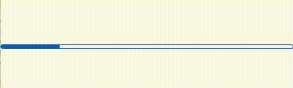
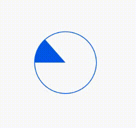
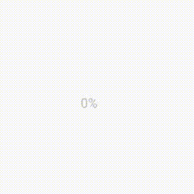

<div align="center">
<h1>Progress Animated</h1>






Progress indicator using reanimated and react native svg

</div>

---

## Table of Contents

1. [Installation](#installation)
2. [Usage](#usage)
3. [Props](#props)
4. [Credits](#built-with)
5. [License](#license)

## Installation

```sh
yarn add progress-react-native
# or
npm install progress-react-native
```

> Also, you need to install [react-native-reanimated](https://github.com/software-mansion/react-native-reanimated), & [react-native-svg](https://github.com/react-native-community/react-native-svg), and follow theirs installation instructions.

## Usage

<details>
  <summary>Progress Bar</summary>

```tsx
import * as React from 'react';
import { StyleSheet, View, Text } from 'react-native';
import ProgressReactNative from 'progress-react-native';

export default function App() {
  return (
    <View style={styles.container}>
      <ProgressReactNative preset={'bar'} indeterminate={false} progress={40} duration={2000} />
    </View>
  );
}

const styles = StyleSheet.create({
  container: {
    flex: 1,
    alignItems: 'center',
    justifyContent: 'center',
  },
});

```

</details>


## Props


## Built With

- [react-native-reanimated](https://github.com/software-mansion/react-native-reanimated)
- [react-native-redash](https://github.com/wcandillon/react-native-redash)
- [react-native-svg](https://github.com/react-native-community/react-native-svg)

## License

MIT

---
</p>
