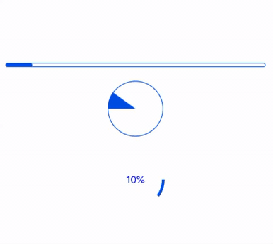

<div align="center">
<h1>Progress Animated</h1>




Progress indicator using reanimated and react native svg

</div>

---

## Table of Contents

1. [Installation](#installation)
2. [Usage](#usage)
3. [Props](#props)
4. [Credits](#built-with)
5. [License](#license)

## Installation

```sh
yarn add progress-react-native
# or
npm install progress-react-native
```

> Also, you need to install [react-native-reanimated](https://github.com/software-mansion/react-native-reanimated), & [react-native-svg](https://github.com/react-native-community/react-native-svg), and follow theirs installation instructions.

## Usage


  <summary>Progress Bar</summary>

```tsx
import * as React from 'react';
import { StyleSheet, View, Text } from 'react-native';
import ProgressReactNative from 'progress-react-native';

export default function App() {
  return (
    <View style={styles.container}>
      <ProgressReactNative preset={'bar'} indeterminate={false} progress={40} duration={2000} />
      <ProgressReactNative preset={'pie'} indeterminate={false} progress={40} duration={2000} />
      <ProgressReactNative preset={'cicle'} showText={true} textConcat={'%'} indeterminate={false} progress={40} duration={2000} />
    </View>
  );
}

const styles = StyleSheet.create({
  container: {
    flex: 1,
    alignItems: 'center',
    justifyContent: 'center',
  },
});

```


## Props
| name           | required | default                          | description                                                                 |
| -------------- | -------- | -------------------------------- | --------------------------------------------------------------------------- |
| preset       | NO       | "bar"                              | Preset for progress.                                            |
| progress         | NO       | 0          | Current progress.              |
| animated           | NO      |     true                             | Flag to use animated when progress change or not. |
| duration          | NO       | 1000     | Duration of animated.                        |
| indeterminate | NO       | false | If set to true, the indicator will spin.                                        |

<summary>Bar Props</summary>

| name           | required | default                          | description                                                                 |
| -------------- | -------- | -------------------------------- | --------------------------------------------------------------------------- |
| height       | NO       | 6                             | Height of the progress bar.                                            |
| color         | NO       | #0057e7          | Color of indicator.              |
| borderRadius           | NO      |     4                             | Rounding of corners, set to 0 to disable. |
| borderColor          | NO       | #0057e7     | Color of outer border.                       |
| borderWith | NO       | 1 | Width of outer border, set to 0 to remove.                                       |

<summary>Circle Props</summary>

| name           | required | default                          | description                                                                 |
| -------------- | -------- | -------------------------------- | --------------------------------------------------------------------------- |
| radius       | NO       | 40                             | Radius of circle.                                            |
| strokeWidth         | NO       | 4         | Width of stroke.              |
| strokeColor           | NO      |     #0057e7                             | Stroke color . |
| bgStrokeColor          | NO       | transparent     | Background stroke color .                       |
| isRadius | NO       | false | Using radius for progress line.   
| showText | NO       | false | Show current progress or not.   
| textConcat | NO       | '' | Text assigned after the progress.   
| textStyle | NO       | '' | Text style for progress.  

<summary>Pie Props</summary>

| name           | required | default                          | description                                                                 |
| -------------- | -------- | -------------------------------- | --------------------------------------------------------------------------- |
| radius       | NO       | 40                             | Radius of Pie.                                            |
| strokeWidth         | NO       | 1        | Width of stroke.              |
| strokeColor           | NO      |     #0057e7                             | Stroke color. |
| fillColor          | NO      | #0057e7       | Color of progress.                       |
| bgColor | NO       | transparent | Background color stroke.   

## Built With

- [react-native-reanimated](https://github.com/software-mansion/react-native-reanimated)
- [react-native-redash](https://github.com/wcandillon/react-native-redash)
- [react-native-svg](https://github.com/react-native-community/react-native-svg)

## License

MIT

---
</p>
